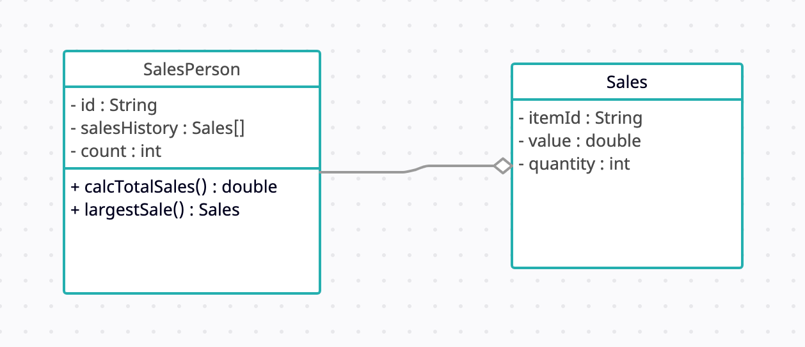

# OOP-Forum-Week-9
## Name: Ostein Vittorio Vellim
## NIM: 2602206783
### A large company with locations in different cities has taken an OOP approach in creating an administration program that manages all aspects of its business. These aspects include:
- ### the sale of all the different products that the company manages
- ### the salaries for managers, office staff and sales personnel.

#### (a) By making use of an example from the above scenario, distinguish between a class and an instantiation of a class. (3 points)
##### A class is a template/blueprint for an object in java, which is the instantiation of a class. For example, managers, office staff, and sales personnel are classes which have properties like names and salaries. In this case, an object would be an instance of a class and contains a certain value for their names and salaries.

#### (b) By giving two examples, explain how the principles of inheritance can be incorporated into the design of this administration program. (4 points)
##### Inheritance is a method in which the methods of a class are inherited to another class in a parent-child relationship. For example: 
- ##### The manager class contains methods inherited by another class called office staff class.
- ##### Product classes like food and drinks can inherit methods from another class called consumables class.

#### (c) Describe how the use of libraries can facilitate the development of programs like this company’s administration program. (3 points)
##### Libraries contain different pre-written methods which can assist the creation of programs without having to create such methods from scratch, thus saving time.


### 2. The company employs several sales personnel to sell its products to different retailers. Each branch of the company keeps track of its own sales with a suite of programs that include the two classes SalesPerson and Sales.

#### (a) Complete the constructor public SalesPerson(String id), from the SalesPerson class. (2 points)

```
public SalesPerson(String id){
    this.id = id;
    this.salesHistory = new Sales[100];
}
```

#### (b) Explain why accessor methods are necessary for the SalesPerson class. (3 points)
##### Accessor methods are needed to access the attributes of private variables. This is to prevent changes made to the private variables.

#### (c) (i) Construct unified modeling language (UML) diagrams to clearly show the relationship between the SalesPerson and Sales classes.
##### Below is the UML diagram showing the relationship between classes SalesPerson and Sales


#### (c) (ii) Outline a negative effect that a future change in the design of the Sales object might have on this suite of programs. (2 points)
##### Changes made to the Sales object will not be compatible with the current program.

### The company employs several sales personnel. The different salesPerson objects are held in the array salesPeople. The Driver class contains various methods that operate on the SalesPerson and Sales classes. The Driver class contains the following code:
```
public static void main(String[] args){

SalesPerson[] salesPeople = new SalesPerson[6];

salesPeople[0] = new SalesPerson("100");

salesPeople[1] = new SalesPerson("101");

salesPeople[2] = new SalesPerson("102");

salesPeople[0].setSalesHistory(new Sales("A100",300.00,10));

salesPeople[0].setSalesHistory(new Sales("A200",1000.00,2));

salesPeople[1].setSalesHistory(new Sales("A300",2550.40,10));

System.out.println(salesPeople[2].getId());

System.out.println(salesPeople[0].getCount());

System.out.println(salesPeople[1].getSalesHistory(0).getValue());

System.out.println(salesPeople[0].calcTotalSales());

 }
```

#### (d) State the output after running this code. (4 points)
##### The output after running the code is: 
```
102
2
2550.4
5000.0
```

#### (e) Construct the method calcTotalSales(), in the SalesPerson class that calculates the total value of the sales for a specific SalesPerson object. (5 points)

```
public double calcTotalSales() {
   double total = 0;
   for (int i = 0; i < count; i++) {
       total += this.salesHistory[i].getValue() * this.salesHistory[i].getQuantity();
   }
   return total;
}
```

### The salesPeople array contains 100 instantiated objects. The company wishes to reward the salesperson whose sales have the largest total value.

#### (f) By making use of any previously written methods, construct the method highest(), that returns the ID of the salesperson whose sales have the largest total value. (5 points)

```
public static String highest(SalesPerson[] salesPeople) {
   double highest = 0;
   String id = "";
   for (SalesPerson salesPerson : salesPeople) {
       double totalSales = salesPerson.calcTotalSales();
       if (totalSales > highest) {
           highest = totalSales;
           id = salesPerson.getId();
       }
   }
   return id;
}
```

#### (g) Construct the method addSales(Sales s, String id), in the Driver class, that will add a new Sales object s, to the salesperson with a specified ID.
#### Note: You can assume that the ID is a valid one. (4 points)

```
public static void addSales(SalesPerson[] salesPeople, Sales s, String id) {
   for (SalesPerson salesPerson : salesPeople) {
       if (salesPerson.getId().equals(id)) {
           salesPerson.setSalesHistory(s);
           break;
       }
   }
}
```

### A further class in this suite of programs is the Payroll class. This class is run at the end of each month to calculate each salesperson’s salary, which is based on the sales that have been made during that month.

#### (h) Suggest changes that must be made to the SalesPerson class and/or the Sales class to allow these calculations to be made. (3 points)
##### A good addition is a variable that can keep track of the date. The sales made in a certain time frame can then be calculated to decide the salary for the workers.
#### (i) Discuss the use of polymorphism that occurs in this suite of programs. (3 points)
##### Polymorphism occurs in the SalesPerson class which contains two constructors. This is an example of overloading.


